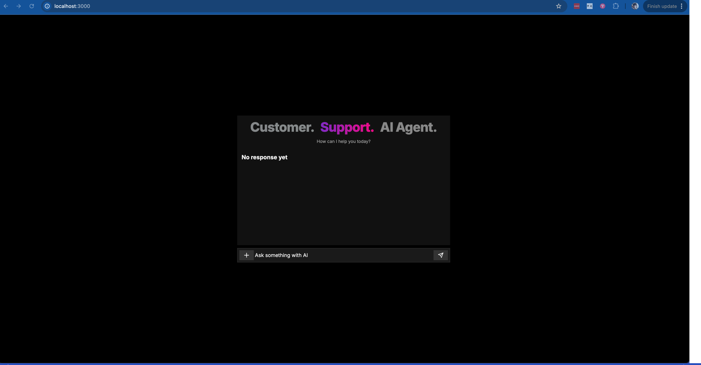
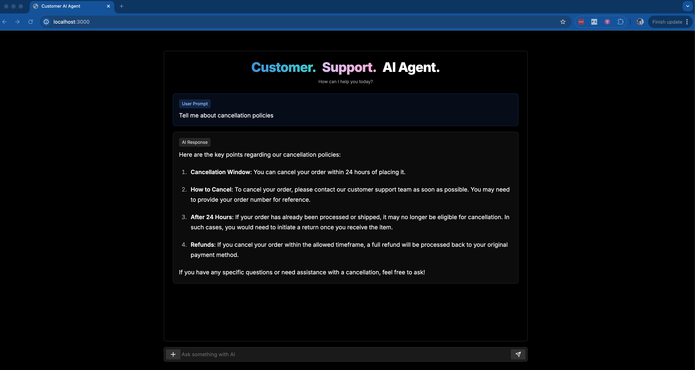
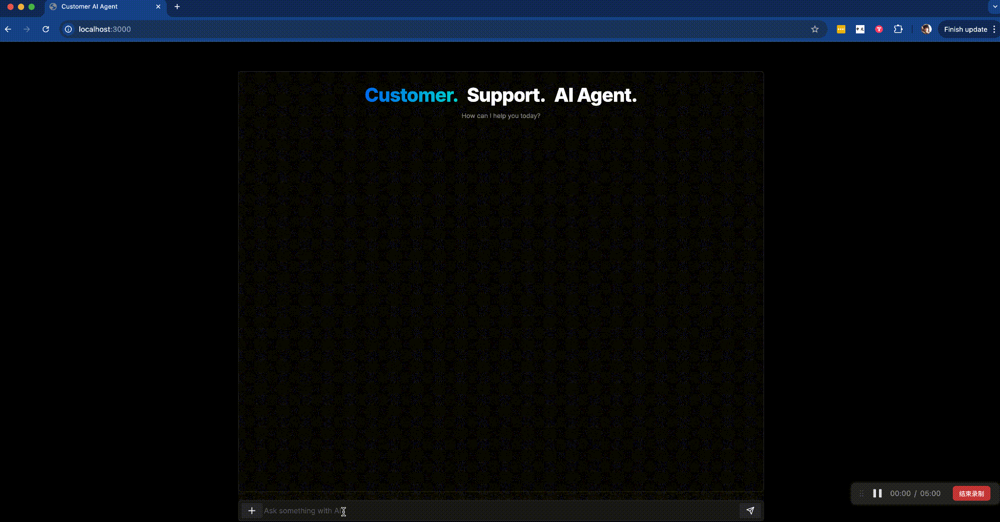

# Customer Support AI Agent

# Purpose

This was a practice project to learn more about AI Agents workflows. Used Langflow as the backend to power my Next.js frontend.

# Instructions

1. Clone the repository
2. Run `npm install`
3. Run `npm run dev` inside of client folder

# Tools Used
For the backend, I used Langflow to create the AI agent and AstraDB to store the chat history.

For frontend, I used Next.js, Shadcn UI, Lucide Icons, and Tailwind CSS.

# Demo

